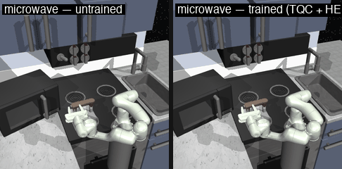
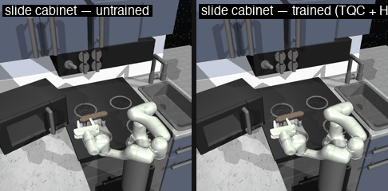
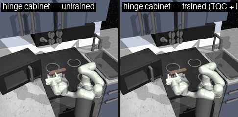
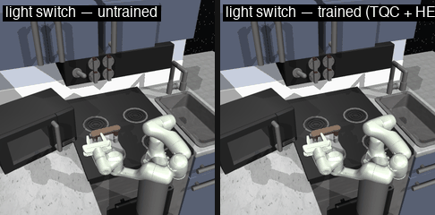
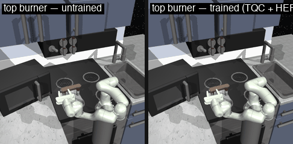
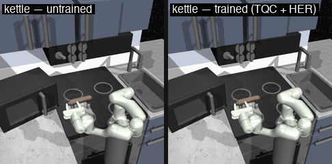

# RoboResearch

**An agentic RL pipeline for FrankaKitchen manipulation, driven by Claude Code as the orchestrator.**

Claude Code edits `train.py` directly: writes the reward wrapper, kicks off training, parses the success rate, diagnoses failures (via env introspection or rendered rollouts), and iterates. The agent commits when an experiment improves the success rate and reverts when it doesn't, so git history doubles as the experiment log.

## Results

All 7 FrankaKitchen-v1 subtasks solved with the **same dense-reward template**, single-CPU laptop, no per-task hyperparameter tuning. Each was trained from scratch with TQC + HER until the in-training eval hit 100% on two consecutive checks (the early-stop criterion), then saved.

| # | Subtask | Goal dim | Steps to first 100% | Wall-clock | Model |
|---|---|---|---|---|---|
| 1 | microwave | 1 | 20k | 9 min | `iter1_microwave_TQC.zip` |
| 2 | slide cabinet | 1 | 50k | 25 min | `iter2_slide_cabinet_TQC.zip` |
| 3 | hinge cabinet | 2 | 70k | 38 min | `iter3_hinge_cabinet_TQC.zip` |
| 4 | light switch | 2 | 55k | 32 min | `iter4_light_switch_TQC.zip` |
| 5 | bottom burner | 2 | 55k | 24 min | `iter5_bottom_burner_TQC.zip` |
| 6 | top burner | 2 | 60k | 26 min | `iter6_top_burner_TQC.zip` |
| 7 | kettle (xyz + quat) | 7 | 30k | 13 min | `iter7_kettle_TQC.zip` |

Eval protocol: 3-episode deterministic eval every 5k steps; "first 100%" is the first eval that hit `subtask in info["episode_task_completions"]` on all 3 episodes. Final 20-episode evals after early-stop are in `progress.log` files per iteration.

### Untrained vs trained (deterministic rollout, side-by-side)









## The reward template

A single dense reward, parameterised by which MuJoCo site the gripper should approach:

```python
shaped_reward = (
    -1.0 * goal_distance        # ||achieved_goal − desired_goal||
    -1.0 * ee_to_target         # ||ee_xyz − target_site_xyz||
    +5.0 * success_bonus        # 1 if goal_distance < 0.3 else 0
)
```

`SUBTASK_TARGET_SITES` maps each subtask to the relevant MuJoCo site (`microhandle_site`, `slide_site`, `hinge_site2`, `light_site`, `kettle_site`, `knob2_site`, `knob4_site`). The `ee_to_target` term gives the policy a smooth gradient toward contact during the long random-exploration phase — the joint-space `goal_distance` term alone has no entry path because the arm essentially never reaches the target by chance in 280 steps.

## What's *not* novel here

- TQC + HER on goal-conditioned manipulation is a textbook recipe.
- Dense `goal_distance + ee_proximity + bonus` reward shaping is the standard from the original HER paper era.
- Individual FrankaKitchen subtasks have been solved before with demos + offline RL (Relay Policy Learning, D4RL Kitchen leaderboard).
- The harder benchmark — sequential 4-subtask chains — also has strong published baselines using offline learning and diffusion / transformer policies.

This repo is **a clean engineering demonstration of an agentic RL workflow**, not a research contribution. The unique angle is the closed-loop process (Claude Code reading env source, diagnosing reward bugs by introspection, iterating on hyperparameters and the reward template) — not the underlying RL math.

## Notable bugs the agent caught

- **iter0 → iter1:** `MICROWAVE_OBS_IDX = 22` was being used as an obs-vector index but is actually a qpos index. The dense distance term was regressing against the wrong joint (top-right burner knob), giving zero useful gradient. Fixed by using `obs["achieved_goal"]` directly. Microwave went from unsolvable to 100% SR after the fix.
- **iter3 hinge cabinet:** initial `SUBTASK_TARGET_SITES["hinge cabinet"] = "hinge_site1"` pointed the EE-proximity term at the LEFT door, but `desired_goal=[0, 1.45]` only requires the RIGHT door (index 1) to open. The dense gradient was actively pulling the arm to the wrong cabinet. Caught by env introspection (printing all hinge-related sites + their xyz). Fixed → SR 0% → 100% in one rerun.
- **iter6 top burner:** training stalled hard (~1s/step) after step 8k. Diagnosed as macOS memory pressure / compressor thrashing from the 1M-transition replay buffer. Shrunk `buffer_size` to 200k → run completed cleanly.

## Architecture

```
train.py     The only editable file — RewardWrapper, env factory, hyperparams
prepare.py   Read-only evaluation infrastructure + reward-component logging
program.md   Agent contract for the autonomous loop
mcp/         FastMCP servers for simulation, evaluation, registry (read-only)
.mcp.json    MCP server config for Claude Code
scripts/     One-off scripts (e.g., render_demos.py for the gallery above)
```

`prepare.py` reloads `train.py` on every call (`importlib.reload`), so the MCP servers always see the agent's latest edits without a restart.

## Quick start

```bash
git clone https://github.com/aymanqroon/roboresearch.git
cd roboresearch

python -m venv .venv
source .venv/bin/activate
pip install -e .

# Run a single experiment
python train.py             # writes model_checkpoint.zip + progress.log

# Re-render the gallery
python scripts/render_demos.py
```

## Tech stack

| Component | Tool |
|-----------|------|
| Agent | Claude Code |
| Simulation | MuJoCo + Gymnasium-Robotics (FrankaKitchen-v1) |
| RL algorithms | Stable-Baselines3 + sb3-contrib (TQC + HER) |
| Tool interface | MCP (FastMCP) |
| DL backend | PyTorch (CPU) |

## What would actually be novel from here

- **Multi-task chains** (e.g., microwave → bottom_burner → top_burner → light_switch) without demos. Hard but not unprecedented; the simple template will fail and a real curriculum is needed.
- **VLM-driven reward iteration** — Claude reads failure rollouts as a vision model and proposes the next reward (the original program.md contract). This was *not* exercised in the work above; the simple template worked first try and never required visual diagnosis.
- **Cross-task transfer** — train one policy that generalises across all 7 subtasks rather than 7 separate policies.

---

*Built by [Ayman Qroon](https://github.com/aymanqroon)*
