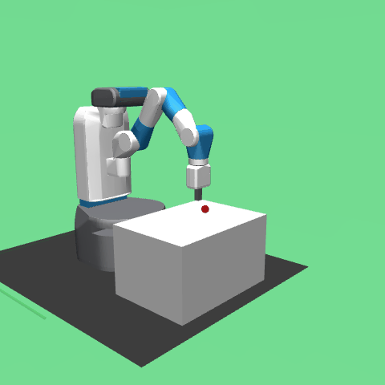
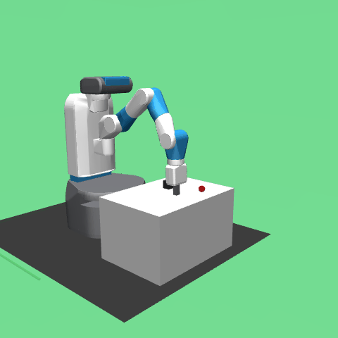
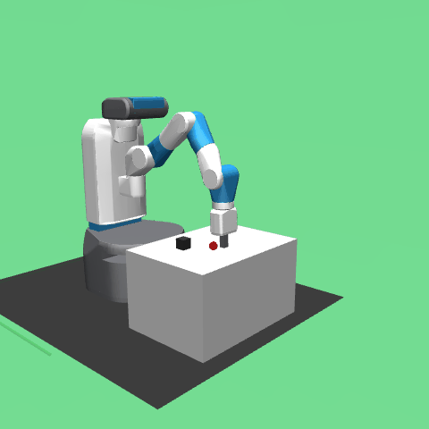
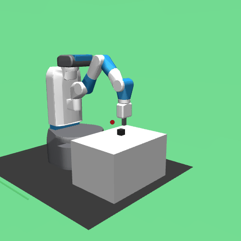
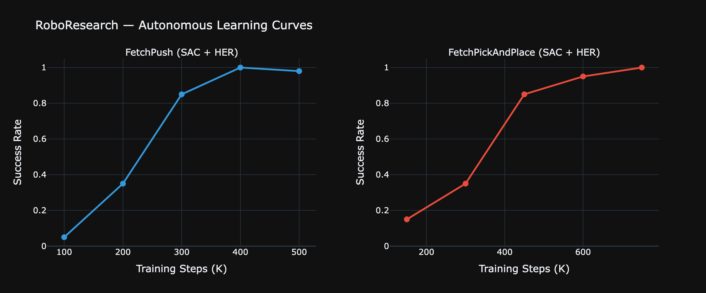

# RoboResearch

**Autonomous agentic AI system for robot manipulation research**

RoboResearch applies Karpathy's [autoresearch](https://github.com/karpathy/autoresearch) concept to robotics. It autonomously plans experiments, trains RL policies in MuJoCo simulation, evaluates performance, visually analyzes failures using a VLM, and iterates — no human in the loop. The system runs overnight, and you wake up to a better robot.

---

## Architecture

```
                     ORCHESTRATOR (Claude Opus)
              Plans experiments, manages research loop

   Experiment Coder       Failure Analyst       Quick Evaluator
      (Sonnet)             (Opus VLM)              (Haiku)
   Writes config        Watches sim frames      Keep/discard
   modifications        finds WHY it failed      decisions
        |                     |                      |
   MCP Server            MCP Server             MCP Server
   SIMULATION            EVALUATION              REGISTRY
        |                     |                      |
        +---------------------+----------------------+
                              |
               MuJoCo / Gymnasium-Robotics
            Robot Manipulation Environments

        FetchReach ---------> FetchPush ---------> FetchPickAndPlace
          (easy)  auto-graduate  (medium)  auto-graduate    (hard)
```

## Demo

### FetchReach — 100% success in 3 experiments

The system masters the reaching task immediately, then auto-graduates to pushing.

| Random Policy (untrained) | Trained Policy (SAC) |
|:---:|:---:|
|  |  |

### FetchPush — 98% success rate

The system graduates to the harder pushing task and trains SAC with HER (Hindsight Experience Replay) to push a block to a goal position.

| Random Policy (untrained) | Trained Policy (SAC + HER) |
|:---:|:---:|
|  |  |

### FetchPickAndPlace — 100% success rate

The hardest Fetch task: the robot must pick up a block and place it at a goal that can be in the air. Requires learning grip control, lifting, and precise placement.

| Random Policy (untrained) | Trained Policy (SAC + HER) |
|:---:|:---:|
|  |  |

### Learning Curves



Both tasks show the characteristic RL learning pattern: slow initial exploration, rapid improvement as HER relabeling kicks in, then convergence near 100%. FetchPush converges in 500K steps (~50 min), FetchPickAndPlace in 750K steps (~83 min on Apple Silicon).

### Autonomous Experiment Log

The system ran autonomous experiments across three tasks, demonstrating the full research loop — planning, training, evaluating, switching algorithms, and iterating:

```
run_id    env                      algo  success_rate  notes
run_001   FetchReach-v4            SAC   1.000         baseline
run_002   FetchReach-v4            SAC   1.000         replicate
run_003   FetchReach-v4            SAC   1.000         <- graduated to FetchPush
run_004   FetchPush-v4             SAC   0.200         push baseline
run_005   FetchPush-v4             SAC   0.200         + HER enabled
run_006   FetchPush-v4             SAC   0.000         smaller net (discarded)
run_009   FetchPush-v4             TD3   0.100         algorithm switch
run_014   FetchPush-v4             TD3   0.150         TD3 peak
run_017   FetchPush-v4             SAC   0.100         back to SAC
run_024   FetchPush-v4             SAC   0.980         extended training (500K steps)
run_025   FetchPickAndPlace-v4     SAC   1.000         extended training (750K steps)
```

The autonomous loop demonstrates algorithm switching (SAC/TD3), warm-starting from checkpoints, VLM failure analysis, keep/discard decision-making, and curriculum advancement across three task difficulties.

## How It Works

The system runs an autonomous research loop:

```
LOOP:
  1. PLAN     -> Orchestrator reviews past results + failure analysis
  2. CODE     -> Experiment Coder generates new training config
  3. TRAIN    -> SAC/PPO/TD3 trains in MuJoCo (warm-start from best checkpoint)
  4. EVAL     -> Run evaluation episodes, compute success rate
  5. ANALYZE  -> VLM watches frames of failed episodes, diagnoses WHY
  6. DECIDE   -> Improved? KEEP. Worse? DISCARD.
  7. ADAPT    -> Switch algorithms or graduate to harder tasks when ready
  8. REPEAT
```

Each model is chosen for a reason — not "use the biggest model everywhere":

| Agent | Model | Why |
|-------|-------|-----|
| **Orchestrator** | Claude Opus | Complex reasoning about research direction and strategy |
| **Experiment Coder** | Claude Sonnet | Fast code generation, cost-effective for frequent modifications |
| **Failure Analyst** | Claude Opus (VLM) | Vision capabilities to understand spatial/physical failures from simulation frames |
| **Quick Evaluator** | Claude Haiku | Lightweight metric parsing, fast keep/discard decisions |

### Key Design Decisions

- **Warm-starting**: Each experiment loads the best previous checkpoint and continues training. Critical for RL where cumulative steps matter — the autoresearch "start fresh" pattern doesn't work for policy optimization.
- **HER (Hindsight Experience Replay)**: Automatically enabled for goal-conditioned Fetch environments with SAC/TD3. Relabels failed trajectories as successes for alternative goals, dramatically improving sample efficiency on sparse-reward tasks.
- **Algorithm switching**: If 5 consecutive experiments show no improvement, the orchestrator switches algorithms (SAC -> TD3 -> PPO) to escape local optima.
- **Task graduation**: 3 consecutive experiments with >80% success rate triggers automatic curriculum advancement (FetchReach -> FetchPush -> FetchPickAndPlace).

## MCP Tool Servers

Three Python MCP servers expose standardized tool interfaces:

### Simulation Server
- `configure_env` — Create Gymnasium-Robotics environments
- `run_training` — Launch RL training with time-budget stopping
- `capture_frames` — Render simulation frames for VLM analysis
- `get_training_log` — Parse training metrics
- `reset_env` — Clean up environment state

### Evaluation Server
- `run_evaluation` — Run deterministic evaluation episodes
- `compute_metrics` — Success rate, reward, episode length
- `compare_runs` — Side-by-side run comparison
- `get_failure_episodes` — Extract failed episodes with frame sequences
- `generate_report` — Full markdown experiment report

### Registry Server
- `save_checkpoint` — Store model + config + metrics
- `load_checkpoint` — Retrieve experiment data
- `list_experiments` — Query experiment history
- `get_best_model` — Find best model for a task
- `diff_configs` — Compare experiment configurations

## Dashboard

A Streamlit dashboard monitors the system in real time:

- Live experiment progress and learning curves
- Agent decision timeline with reasoning
- Cost tracker (per-agent token usage)
- Episode video playback (successes and failures)

```bash
streamlit run roboresearch/dashboard/app.py
```

## Quick Start

```bash
# Clone
git clone https://github.com/aymanqroon/roboresearch.git
cd roboresearch

# Install
python -m venv .venv
source .venv/bin/activate
pip install -e .

# Configure — Option A: Direct Anthropic API
export ANTHROPIC_API_KEY=sk-ant-...

# Configure — Option B: GCP Vertex AI
# Set up GCP auth (gcloud auth application-default login)
# Optionally set VERTEX_PROJECT_ID and VERTEX_REGION env vars

# Run
python -m roboresearch.main --max-experiments 50 --time-budget 300
```

## Project Structure

```
roboresearch/
  agents/
    client.py              # LLM client factory (Anthropic API / Vertex AI)
    orchestrator.py         # Main research loop + experiment planning
    experiment_coder.py     # Generates training configs from natural language plans
    failure_analyst.py      # VLM-based visual failure diagnosis
    quick_evaluator.py      # Fast keep/discard decisions
  mcp_servers/
    simulation/server.py    # MuJoCo environment + training tools
    evaluation/server.py    # Model evaluation + metrics tools
    registry/server.py      # Experiment tracking + checkpoint tools
  training/
    trainer.py              # SB3 training wrapper (SAC, PPO, TD3 + HER)
    evaluator.py            # Evaluation episodes + metrics
    recorder.py             # Video recording for demos
    configs.py              # Default hyperparameter configs
    env_utils.py            # Gymnasium-Robotics environment setup
  dashboard/
    app.py                  # Streamlit dashboard
    pages/                  # Learning curves, experiment log, cost tracker, videos
  main.py                   # Entry point
scripts/
  generate_demos.py         # Generate GIFs and charts from trained models
program.md                  # Human-written research directions (the "prompt")
```

## Tech Stack

| Component | Tool | Why |
|-----------|------|-----|
| Agent Orchestration | Anthropic SDK + custom | Full control over model selection, tool binding, and cost |
| Tool Interface | MCP Python SDK | Standardized, composable tool servers |
| Simulation | MuJoCo + Gymnasium-Robotics | Industry standard, free |
| RL Algorithms | Stable-Baselines3 (SAC/PPO/TD3) | Battle-tested, focus on the agentic system |
| Deep Learning | PyTorch | Backend for SB3 |
| Dashboard | Streamlit + Plotly | Zero frontend code, interactive charts |
| Experiment Tracking | Git + TSV + JSON | Autoresearch pattern — git history IS the research narrative |

---

*Built by [Ayman Qroon](https://github.com/aymanqroon)*
